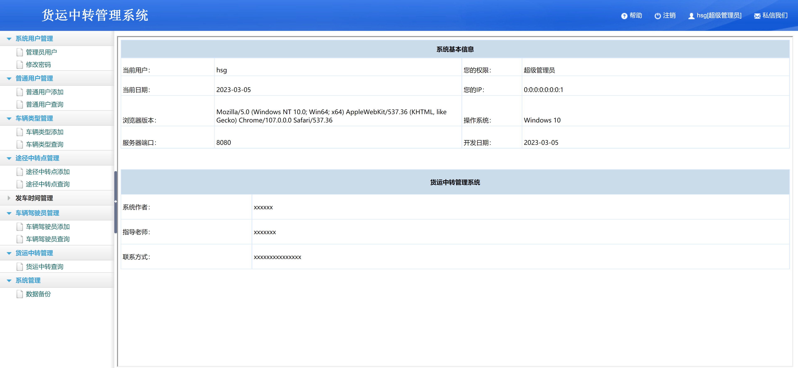
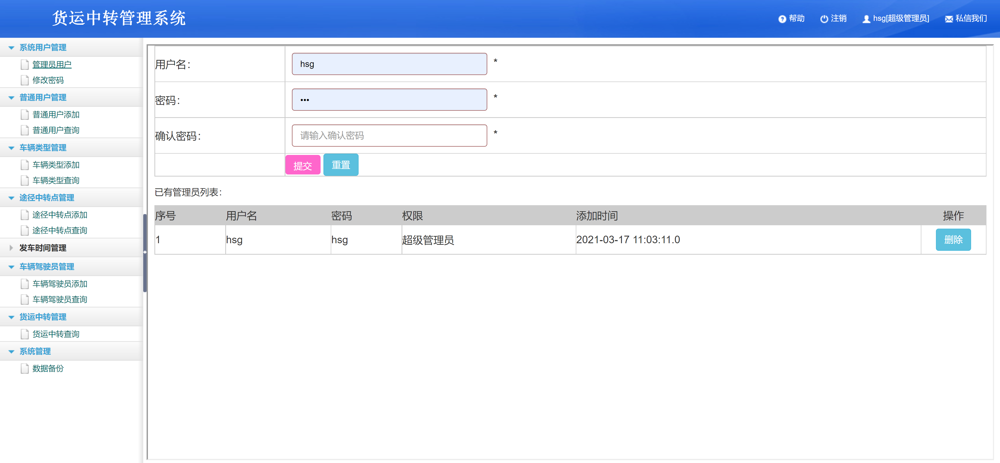
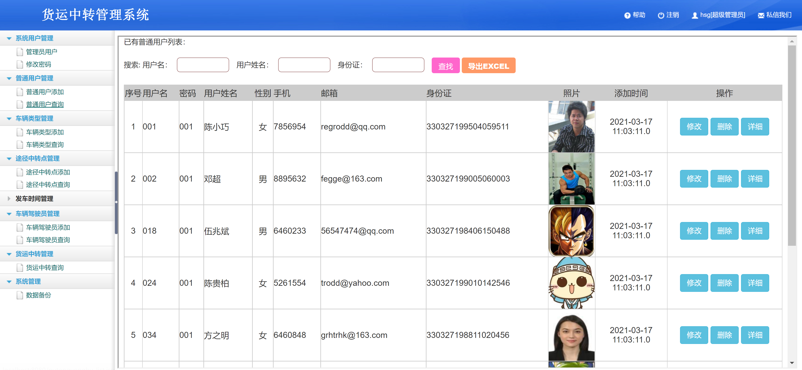
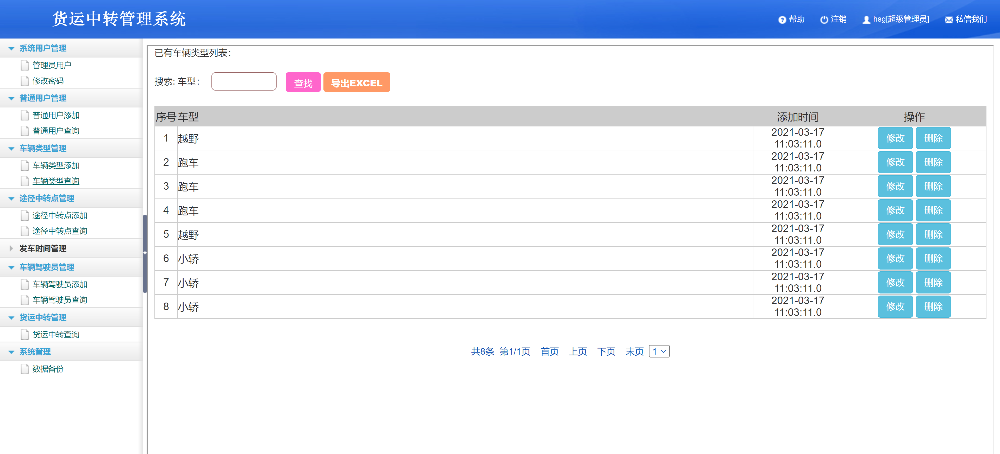
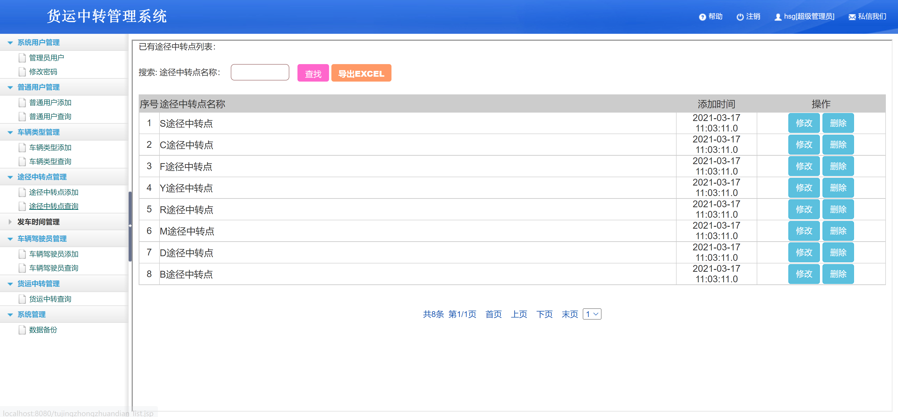
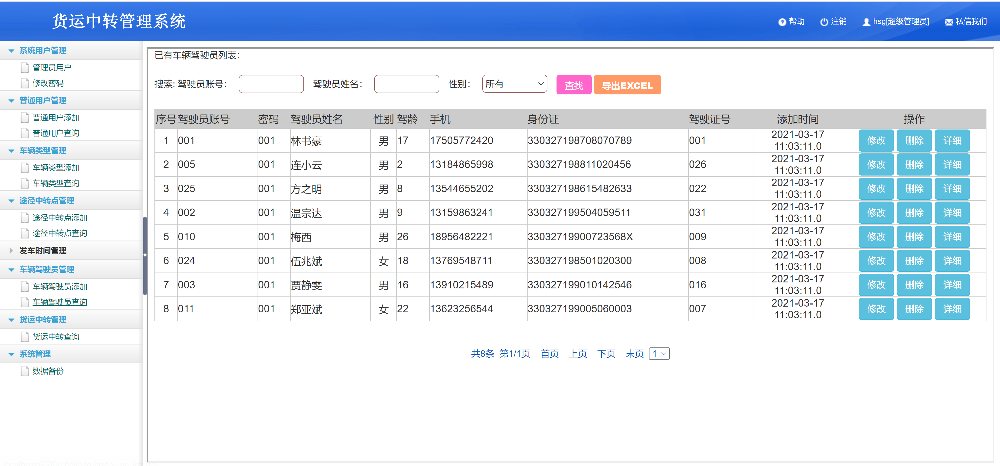
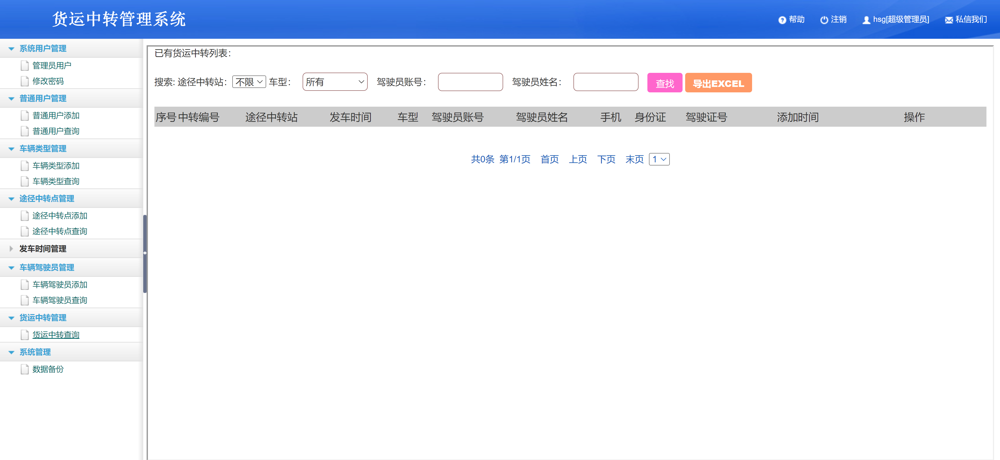

<h1 align="center">货运中转管理系统</h1>

## 简介
货运中转管理系统：角色分为系统用户、普通用户；包括用户管理、车辆类型管理、途径中转点管理、发车时间管理、车辆驾驶员管理、数据备份等功能模块。    --计算机毕业设计源码；毕设源码；java毕业设计源码

## 联系方式

<h3 align="center">获取完整代码与数据库文件 + 微信：bysj5151 QQ: 86050149 QQ群: 783742310</h3>

<h3 align="center">可帮忙远程部署 包运行成功！提供远程部署、修改代码、设计文档指导、代码讲解等服务！</h3>

## 功能介绍（完整见运行截图）
管理员：可以管理用户账户，包括添加、删除、查看和修改用户信息，也能管理车辆类型、途径中转点、发车时间和驾驶员信息。系统支持数据的搜索和导出为Excel文件，并提供系统管理、用户权限设置及系统数据备份功能。界面包含帮助、注册、用户信息和联系客服入口。

驾驶员：可通过系统查看和管理自己的账户信息，包括查看和修改个人基本信息，如姓名、性别、年龄、联系信息和驾驶证号等。系统也允许驾驶员通过搜索功能查询信息，并支持数据导出为Excel文件。

## 运行截图

本代码来源于网络,仅供学习参考使用!

